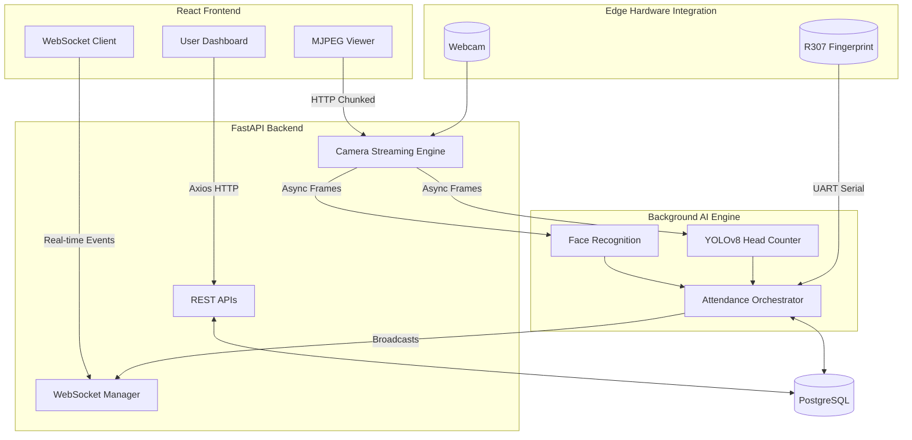
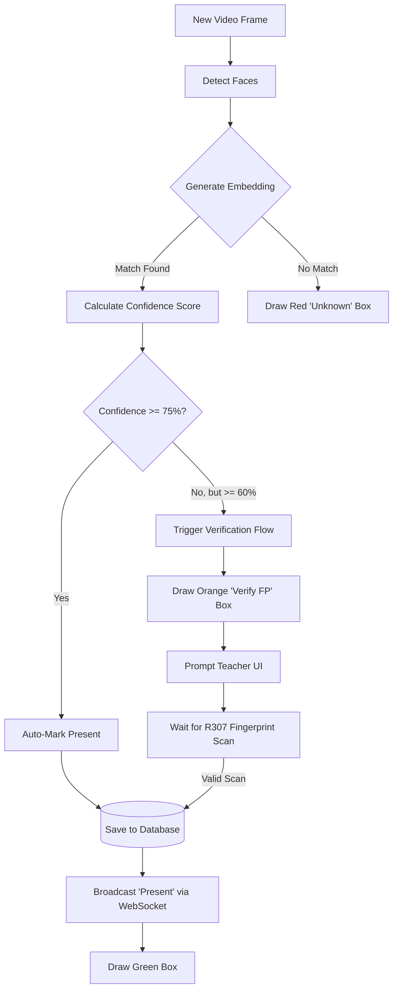

<div align="center">
  <h1>ClassOS: AI-Powered Embedded Classroom Attendance System</h1>
  <p>
    <strong>The ultimate, fully automated classroom attendance solution. 
    <br>Powered by Computer Vision, Hardware Biometrics, and a Modern Web Stack on the Edge.</strong>
  </p>

  <p>
  
  
  
  
  
  
  
</p>
</div>  
  
---

## 🌟 Introduction: Why ClassOS is One of a Kind

Most automated attendance systems fall into two categories: cloud-dependent APIs that are slow and compromise student privacy, or fragile local scripts that lack a modern user interface. 

**ClassOS bridges the gap by delivering a state-of-the-art enterprise architecture running entirely on the Edge.** 
By leveraging the Raspberry Pi 5, ClassOS handles computationally heavy AI inferencing locally, orchestrates low-level hardware serial communication (UART) for fingerprint fallback, and serves a beautiful, high-performance React dashboard to any device on the network—all without requiring an active internet connection. It is a complete, self-contained operating environment for the modern classroom.

---

## 📑 Table of Contents

- [Introduction: Why ClassOS is One of a Kind](#-introduction-why-classos-is-one-of-a-kind)
- [Core Features](#-core-features)
- [Technology Stack](#️-technology-stack)
- [System Architecture](#-system-architecture)
  - [Project Structure](#-project-structure)
  - [Component Breakdown](#-component-breakdown)
- [AI & Logic Pipeline](#-ai--logic-pipeline)
  - [The AI Models](#-the-ai-models)
  - [Recognition Thresholds](#-recognition-thresholds)
- [Hardware Integration](#-hardware-integration)
  - [Embedded Hardware Design](#-embedded-hardware-design)
  - [R307 Wiring Guide](#-r307-wiring-guide)
- [User Experience & Dashboard](#️-user-experience--dashboard)
  - [Step-by-Step Usage Guide](#-step-by-step-usage-guide)
- [Getting Started](#-getting-started)
  - [Quick Start Deployment](#-quick-start-deployment)
  - [Development Setup](#️-development-setup)
- [Security & Privacy](#-security--privacy)
- [Extended Documentation](#-extended-documentation)
- [Future Roadmap](#️-future-roadmap)
- [Developers](#developers)
- [License & Acknowledgments](#-license--acknowledgments)

---

## 🚀 Core Features

- **Dual-Camera Attendance System:** Two cameras serving distinct roles — Camera 0 (entry door, face recognition) and Camera 1 (classroom ceiling, head counting). Both modes switchable mid-session without data loss.
- **USB Webcam Auto-Fallback:** If a CSI Camera Module is unavailable, the system automatically probes a configurable list of USB webcam device indices and uses the first one that opens — zero code changes required, controlled via `.env`.
- **Take Attendance Mode:** Camera 0 runs the face recognition pipeline. Students are auto-marked present when entering the room.
- **Verify Head Count Mode:** Camera 1 runs YOLOv8 Nano to count all heads in the classroom and compares vs recognized attendance. Instantly flags mismatches.
- **Automated AI Face Recognition:** Real-time face detection using dlib algorithms. Auto-marks at ≥70% confidence, requests fingerprint at 30–69%, ignores unknowns <30%.
- **R307 Biometric Fallback:** Seamless fallback to physical fingerprint scanning over UART. Available even when no face is detected at all.
- **EXIF-Aware Face Enrollment:** Gallery photos from phones (portrait-mode JPEG) are automatically rotated based on their EXIF orientation tag before face detection, eliminating the most common cause of enrollment failures.
- **Universal Webcam Support for Enrollment:** The face registration page intelligently selects the front/selfie camera on phones, the built-in webcam on laptops, and Camera 0 (`/dev/video0`) when the browser runs directly on the Raspberry Pi — all automatically.
- **20×4 LCD Display:** Real-time hardware status display shows "Total Attendee: X / Name Present" during attendance, and "Present = X / Head Count = X / ✓ Match" during head count. Dashboard mirrors the LCD in real-time.
- **Live MJPEG Video Streaming:** Teachers watch Camera 0 or Camera 1 (mode-dependent) with annotated AI bounding boxes in real-time.
- **Real-Time WebSocket Sync:** As students are detected, their full names instantly appear on the teacher's screen without refreshing.
- **Full-Stack Analytics:** Automatic data aggregation with CSV exports, visual charts, and historical session logs.
- **Role-Based Access Control:** Distinct experiences for Admins, Teachers, and Students.
- **Ghost-Session Resiliency:** The backend automatically recovers and cleans up abandoned sessions if a teacher's laptop disconnects unexpectedly.
- **One-Command Deployment:** Completely containerized with Docker Compose.

---

## 🛠️ Technology Stack

**Frontend**
- **Framework:** React 18 with Vite
- **Styling:** Tailwind CSS + UI components inspired by shadcn/ui
- **State Management:** React Context API
- **Charts:** Chart.js (via react-chartjs-2)

**Backend**
- **Framework:** FastAPI (Python 3.11)
- **Database ORM:** SQLAlchemy (Async)
- **Authentication:** JWT (JSON Web Tokens) with bcrypt
- **Real-time:** WebSockets for live attendance broadcasting

**AI & Computer Vision**
- **Face Recognition:** dlib (ResNet-based 128D embeddings)
- **Object Detection:** YOLOv8 Nano by Ultralytics
- **Image Processing:** OpenCV (cv2)

**Infrastructure & Hardware**
- **Database:** PostgreSQL 16
- **Deployment:** Docker & Docker Compose
- **Hardware:** Raspberry Pi 5
- **Biometrics:** R307 Optical Fingerprint Sensor (via UART)

---

## 🏗️ System Architecture

ClassOS utilizes a heavily decoupled microservice-like structure packaged securely inside Docker containers.



### 📂 Project Structure

```text
ClassOS/
├── ai_engine/              # FaceRecognitionPipeline (Camera 0) + HeadCountPipeline (Camera 1)
├── attendance_engine/      # Dual-mode orchestrator (Take Attendance / Verify Head Count)
├── backend/                # FastAPI application layer (REST endpoints, WebSockets, Auth)
├── camera_service/         # Dual-camera management (camera_0, camera_1 singleton instances)
├── database/               # Database connection logic and Alembic migration scripts
├── docker/                 # Dockerfiles used to containerize the different services
├── docs/                   # Extended project documentation (ER Diagrams, API references)
├── fingerprint_service/    # Hardware serial communication (UART) for the R307 sensor
├── frontend/               # The React SPA built with Vite and Tailwind CSS
├── lcd_service/            # 20×4 I2C LCD driver (RPLCD + smbus2, graceful fallback)
├── models/                 # Shared SQLAlchemy ORM models defining the database schema
├── nginx/                  # Reverse proxy configuration for routing traffic in production
├── scripts/                # Utility and hardware testing scripts (seed_db.py, test_camera.py)
└── docker-compose.yml      # Orchestrates all containers (Frontend, Backend, DB, Nginx)
```

### 🔍 Component Breakdown

#### 1. The Edge Server (Raspberry Pi 5)
- **Role:** The central computing hub that runs the entire software stack. By acting as an edge node, it guarantees sub-second latency for heavy AI inferencing without relying on external cloud servers or active internet connections.
- **Interconnection:** Connects to the local network to serve the React frontend to teacher/student devices, interfaces with the R307 biometric sensor via low-level GPIO/UART pins, and reads raw video frames from the USB webcam.
- **Subcomponents:**
  - **OS Level Daemon:** Manages USB drivers for the webcam and UART configuration.
  - **Docker Engine:** Orchestrates the PostgreSQL, FastAPI backend, and Nginx reverse proxy containers.

#### 2. Frontend Dashboard (React + Vite)
- **Role:** A modern, responsive Single Page Application (SPA) serving tailored experiences for Admins, Teachers, and Students.
- **Working Principle:** The frontend uses standard REST HTTP requests (`axios`) for CRUD operations, course management, and historical data analytics. During live attendance sessions, it establishes a persistent **WebSocket** connection to the backend to receive real-time JSON payloads (e.g., `face_recognized`, `head_count_mismatch`), avoiding the latency of HTTP polling. It also reads a continuous `multipart/x-mixed-replace` HTTP response to render the live MJPEG camera feed directly in the browser.
- **Subcomponents:**
  - **React Router:** Manages client-side navigation between views.
  - **Context API (AuthContext):** Manages global authentication state, token storage, and Role-Based Access Control (RBAC) to selectively render UI elements.
  - **Axios Interceptors:** Automatically attaches JWT tokens to outgoing requests and handles automatic token refreshing upon expiration.
  - **Chart.js Wrappers:** Renders visual analytics and attendance pie/bar charts.

#### 3. Backend Orchestrator (FastAPI)
- **Role:** The highly-concurrent core application layer that bridges the database, the frontend WebSockets, and the background AI models.
- **Working Principle:** Written in asynchronous Python, FastAPI exposes JWT-secured REST endpoints. When a teacher initiates an attendance session, FastAPI spawns a background hardware thread. This thread continuously pulls frames from the camera, feeds them to the AI models, and uses an asynchronous `BroadcastManager` to push real-time event alerts directly to the connected frontend clients.
- **Subcomponents:**
  - **JWT Middleware:** Verifies tokens and extracts user roles for endpoint protection.
  - **ConnectionManager:** Maintains active WebSocket connections and handles disconnects/reconnects without dropping live session states.
  - **Pydantic Schemas:** Enforces strict data validation and serialization for all incoming and outgoing API traffic.

#### 4. Database Layer (PostgreSQL 16)
- **Role:** The persistent relational storage for users, courses, attendance logs, and biometric data.
- **Working Principle:** Interfaced via the `SQLAlchemy` ORM. The 128D face embeddings are stored efficiently as float arrays. The schema is highly normalized with strict foreign-key constraints and cascading deletions (e.g., deleting a course automatically purges all orphaned attendance sessions and student enrollments tied to it).
- **Subcomponents:**
  - **Alembic Migrations:** Manages database schema versioning and iterative updates.
  - **Async Session Engine:** Utilizes `asyncpg` to allow FastAPI to handle thousands of concurrent queries without blocking the event loop.

---

## 🤖 AI & Logic Pipeline

To prevent duplicate database writes and handle uncertain identifications, ClassOS implements a strict state-machine flow for every detected face.



### 🧠 The AI Models

ClassOS uses a dual-model approach to ensure extremely high accuracy without bogging down the Raspberry Pi's CPU.

1. **Face Embedding (dlib / ResNet):** When a student is enrolled, ClassOS extracts a 128-dimensional embedding of their face using a ResNet network trained on 3 million faces. During a live session, the system calculates the Euclidean distance between the live camera face and the stored database embeddings to generate a confidence percentage.
2. **Crowd Verification (YOLOv8 Nano):** Face recognition alone can miss students sitting far back or looking down. To prevent proxy attendance and ensure total accuracy, we run Ultralytics' YOLOv8-nano model in the background to count the total number of human heads in the frame. If the head count exceeds the recognized face count, the teacher is alerted.

### 🎯 Recognition Thresholds

| Confidence Score | Action Taken | LCD | Logging Method |
|------------------|--------------|-----|----------------|
| **≥ 70%** | Automatic Attendance | "Name >> Present" | `FACE` |
| **30% – 69%** | Fingerprint Verification Prompt | "Fingerprint Needed!" | `FINGERPRINT` |
| **< 30%** | Ignored / Labeled Unknown | — | None |
| **No face** | Direct Fingerprint Scan available | Prompt button visible | `FINGERPRINT` |

> ⚙️ All thresholds are configurable: `FACE_CONFIDENCE_AUTO=0.70`, `FACE_CONFIDENCE_FINGERPRINT=0.30` in `.env`

---

## 🔌 Hardware Integration

ClassOS requires direct hardware integration. The Raspberry Pi 5 orchestrates standard USB protocols alongside direct GPIO Serial Communication.

### 💻 Embedded Hardware Design

| Component | Model | Interface | Purpose |
|-----------|-------|-----------|---------|
| Compute | Raspberry Pi 5 (8GB) | — | Main edge server |
| Camera 0 | RPi Camera Module v2/v3 **or USB webcam** | CSI (CAM/DISP 0) or USB | Entry door — face recognition |
| Camera 1 | RPi Camera Module v2/v3 **or USB webcam** | CSI (CAM/DISP 1) or USB | Classroom ceiling — head counting |
| Biometric | R307 Optical Sensor | UART (GPIO) | Identity fallback verification |
| Display | 20×4 HD44780 LCD + PCF8574 | I2C (GPIO 2/3) | Real-time status feedback |

> 💡 **USB Webcam Fallback**: If a CSI camera is unavailable, the system automatically tries USB webcam device indices listed in `CAMERA_USB_FALLBACK_INDICES` (`.env`). Set `CAMERA_USB_FALLBACK_INDICES=1` for a single USB webcam. If only one camera is available in total, connect it to Camera 0 — the "Verify Head Count" mode is automatically disabled.

### 📠 R307 Wiring Guide

| R307 Pin | Pi 5 GPIO Pin | Wire Color |
|----------|---------------|------------|
| VCC (3.3V) | Pin 1 (3.3V) | Red |
| GND | Pin 6 (GND) | Black |
| TX | Pin 10 (GPIO15 / RXD1) | Yellow |
| RX | Pin 8 (GPIO14 / TXD1) | Green |

### 📠 LCD I2C Wiring Guide

| LCD Backpack Pin | Pi 5 GPIO Pin |
|-----------------|---------------|
| VCC | Pin 2 or 4 (5V) |
| GND | Pin 6 (GND) |
| SDA | Pin 3 (GPIO2 / SDA1) |
| SCL | Pin 5 (GPIO3 / SCL1) |

> ⚠️ Enable I2C: `sudo raspi-config` → Interface Options → I2C → Enable. Default address: `0x27`.

> ⚠️ Enable UART for fingerprint: Add `enable_uart=1` and `dtoverlay=uart0` to `/boot/firmware/config.txt`.

📖 Full wiring details: **[Hardware Wiring Guide](docs/hardware_wiring.md)**

---

## 🖥️ User Experience & Dashboard

The frontend is a beautifully designed SPA (Single Page Application) built with **React, Vite, and Tailwind CSS**. 

**Web Dashboard & Analytics Capabilities:**
- **Live Attendance View:** Watch the AI draw bounding boxes over the classroom in real time while a live-updating roster syncs beside it.
- **Analytics & History:** View historical session logs, overall attendance rates, and visualize pie charts differentiating face vs fingerprint authentications.
- **CSV Data Export:** Generate downloadable `.csv` spreadsheets of session data with a single click.
- **Face/Fingerprint Enrollment:** Admins can securely enroll new students directly from the browser using the Pi's connected hardware.

### 📖 Step-by-Step Usage Guide

1. **Student Account Creation & Management:** 
   - An Admin navigates to the **Students** tab and clicks "Add Student".
   - The admin inputs the student's ID, Name, and Email. This creates a student profile and a login account (default password: `student123`).
   - Admins can also Edit details or Delete a student completely.
2. **Student Self-Service (Optional but recommended):**
   - Students can log in to their own portal.
   - From the **Face Enrollment** tab, students can use their webcam or upload photos to register their facial data.
   - From the **Available Courses** tab, students can enroll themselves into the classes they are taking, or un-enroll if needed.
   - From the **My Attendance** tab, students can monitor their attendance records and percentages.
3. **Admin/Teacher Course Configuration:**
   - The teacher creates a new Course (e.g., "CS101"), and can Edit or Delete it at any time.
   - If students haven't self-enrolled, the teacher can manually select which students are enrolled in that class, or un-enroll them.
   - Admins can also manually enroll biometrics using the physical hardware.
4. **Running a Session:**
   - At the start of a lecture, the teacher logs into ClassOS, goes to the **Attendance** tab, and clicks "Start Session".
   - The Raspberry Pi immediately boots up the AI background thread, turns on the camera, and begins streaming the live MJPEG feed to the dashboard.
   - As students walk into the room, bounding boxes appear around their faces. Green boxes indicate they have been successfully logged in the database.
5. **Exporting Data:**
   - After class, the teacher clicks "End Session". They can navigate to the **Analytics** tab to download a CSV of the exact time and method (Face vs Fingerprint) each student used to check in.
   - Alternatively, teachers can go to the **Courses** page and click **View Report** to see a full, aggregated attendance spreadsheet across all dates for the course, including auto-calculated scores and percentages, and export it as a CSV.

---

## ⚡ Getting Started

### 🚀 Quick Start Deployment

Deploying the entire infrastructure is done with a single Docker command.

**Prerequisites**
- Docker Engine & Docker Compose
- Raspberry Pi 5 running 64-bit Debian/Ubuntu

**Installation**

```bash
# 1. Clone the repository
git clone https://github.com/AbirHasanArko/ClassOS.git
cd ClassOS

# 2. Configure environment variables
cp .env.example .env

# 3. Generate local SSL Certificates
chmod +x scripts/generate_ssl.sh
./scripts/generate_ssl.sh

# 4. Build and launch all containers
docker compose up -d --build

# 5. Access the web dashboard (It will redirect to HTTPS)
open https://<YOUR_PI_IP_ADDRESS>
```

**Default Admin Credentials**
- **Email:** `admin@classos.local`
- **Password:** `changeme123` *(Change this immediately!)*

### 🛠️ Development Setup

If you wish to run the app outside of Docker for development:

**Backend**
```bash
python3.11 -m venv venv
source venv/bin/activate
pip install -r backend/requirements.txt
python -m scripts.seed_db
uvicorn backend.main:app --reload --host 0.0.0.0 --port 8000
```

**Frontend**
```bash
cd frontend
npm install
npm run dev
```

---

## 🔒 Security & Privacy

- **JWT Authentication:** Secure API endpoints with expiring tokens.
- **Edge Processing:** Images are processed locally in RAM and discarded immediately. Video feeds and facial data are **never** sent to external cloud servers, protecting student privacy.
- **Password Hashing:** Strict bcrypt hashing (12 rounds) for all user passwords.
- **Database Safety:** SQLAlchemy ORM strictly prevents SQL Injection attacks.

---

## 📚 Extended Documentation

For deeper technical dives, please refer to the dedicated documentation files:

- 📊 **[Database ER Diagram (ER_DIAGRAM.md)](docs/ER_DIAGRAM.md)**
- 📖 **[Workflow Guide (workflow_guide.md)](docs/workflow_guide.md)**
- 🔌 **[Hardware Wiring Guide (hardware_wiring.md)](docs/hardware_wiring.md)**
- 🚀 **[Deployment Guide (deployment_guide.md)](docs/deployment_guide.md)**
- 📷 **[Face Enrollment & Camera Guide (face_enrollment_guide.md)](docs/face_enrollment_guide.md)**
- 🧪 **[Testing Guide (testing_guide.md)](docs/testing_guide.md)**
- 📡 **[API Reference (api_reference.md)](docs/api_reference.md)**  
- 🔐 **[Camera Permissions Guide (camera_permissions_guide.md)](docs/camera_permissions_guide.md)**

---

## 🗺️ Future Roadmap

- [x] **Dual-Camera Support:** Camera 0 for face recognition (entry), Camera 1 for head counting (classroom ceiling). ✅ Implemented v2.0
- [x] **20×4 LCD Display:** Real-time hardware feedback with student names, attendance count, and head count match/mismatch. ✅ Implemented v2.0
- [x] **Improved Recognition Thresholds:** 70% auto-mark, 30–69% fingerprint prompt. ✅ Updated v2.0
- [x] **Split Session Modes:** Take Attendance vs Verify Head Count — switchable mid-session. ✅ Implemented v2.0
- [x] **USB Webcam Auto-Fallback:** Camera 0 and Camera 1 automatically fall back to USB webcams if CSI cameras are unavailable. Configurable via `CAMERA_USB_FALLBACK_INDICES` in `.env`. ✅ Implemented v2.1
- [x] **EXIF-Aware Face Enrollment:** Portrait-mode phone photos are auto-rotated using EXIF metadata before face detection, fixing gallery upload failures. ✅ Implemented v2.1
- [x] **Smart Webcam Selection:** Face registration webcam correctly uses front camera on phones, built-in webcam on laptops, and Camera 0 on Raspberry Pi. ✅ Implemented v2.1
- [ ] **Offline Resilience:** Cache attendance data locally on the Raspberry Pi if the Wi-Fi drops and auto-sync when connection is restored.
- [ ] **Biometric Data Encryption & Privacy:** Implement encryption at rest for biometric vectors and automated scripts to purge data for graduated students.
- [ ] **Automated Notifications:** Email/SMS alerts for students when attendance drops below threshold, and weekly CSV reports for teachers.
- [ ] **"At-Risk" Predictive Analytics:** Dashboard insights highlighting students with trending negative attendance patterns.
- [ ] **Calendar Integrations:** Auto-start hardware sessions exactly when classes are scheduled in Google Calendar or Outlook.
- [ ] **Teaching Assistant (TA) Role:** A new permission tier that can start/stop sessions without destructive capabilities.
- [ ] **Progressive Web App (PWA):** Make the frontend installable natively on iOS/Android home screens.
- [ ] **RTSP Multi-Camera Array:** Support for an array of RTSP IP cameras stationed around a large lecture hall.
- [ ] **RFID Integration:** Add a tertiary fallback mechanism using standard student RFID cards.

---

## <a id="developers"></a>👨‍💻 Developers

**Abir Hasan Arko**  
🐙 [GitHub](https://github.com/AbirHasanArko) | 💼 [LinkedIn](https://www.linkedin.com/in/abirhasanarko/)

**Md Shomik Shahriar**  
🐙 [GitHub](https://github.com/Hapi-Guy) | 💼 [LinkedIn](https://www.linkedin.com/in/shomik101001/)

---

## 📝 License & Acknowledgments

This project is open-source and intended for educational innovation in smart classrooms. 

**Powered By:**
- [FastAPI](https://fastapi.tiangolo.com/) by Sebastián Ramírez
- [React](https://react.dev/) by Meta
- [face_recognition](https://github.com/ageitgey/face_recognition) by Adam Geitgey
- [YOLOv8](https://github.com/ultralytics/ultralytics) by Ultralytics
