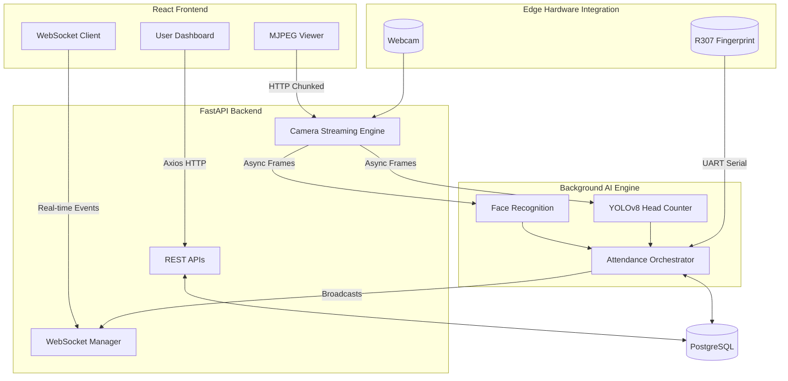
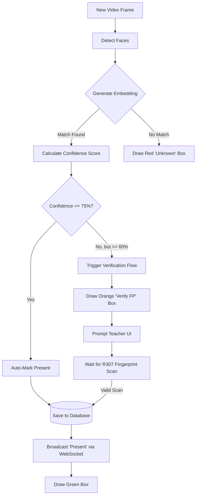

# 🎓 ClassOS — Edge AI Classroom Attendance System

<p align="center">
  <strong>The ultimate, fully automated classroom attendance solution. 
  <br>Powered by Computer Vision, Hardware Biometrics, and a Modern Web Stack on the Edge.</strong>
</p>

<p align="center">
  
  
  
  
  
  
  
</p>

---

## 👨‍💻 Developers

**Abir Hasan Arko** — Lead Developer  
📧 [abirhasanarko2004@gmail.com](mailto:abirhasanarko2004@gmail.com) | 🐙 [GitHub](https://github.com/AbirHasanArko) | 💼 [LinkedIn](https://www.linkedin.com/in/abirhasanarko/)

**Md Shomik Shahriar** — Developer  
🐙 [GitHub](https://github.com/Hapi-Guy) | 💼 [LinkedIn](https://www.linkedin.com/in/shomik101001/)

---

## 📑 Table of Contents

- [🌟 Why ClassOS is One of a Kind](#-why-classos-is-one-of-a-kind)
- [🚀 Core Features](#-core-features)
- [🏗️ System Architecture](#-system-architecture)
- [🤖 AI & Logic Pipeline](#-ai--logic-pipeline)
- [🔌 Embedded Hardware Design](#-embedded-hardware-design)
- [💻 Web Dashboard & Analytics](#-web-dashboard--analytics)
- [⚡ Quick Start Deployment](#-quick-start-deployment)
- [🛠️ Development Setup](#️-development-setup)
- [🔒 Security](#-security)
- [📝 License & Acknowledgments](#-license--acknowledgments)

---

## 🌟 Why ClassOS is One of a Kind

Most automated attendance systems fall into two categories: cloud-dependent APIs that are slow and compromise student privacy, or fragile local scripts that lack a modern user interface. 

**ClassOS bridges the gap by delivering a state-of-the-art enterprise architecture running entirely on the Edge.** 
By leveraging the Raspberry Pi 5, ClassOS handles computationally heavy AI inferencing locally, orchestrates low-level hardware serial communication (UART) for fingerprint fallback, and serves a beautiful, high-performance React dashboard to any device on the network—all without requiring an active internet connection.

---

## 🚀 Core Features

- **Automated AI Face Recognition:** Real-time face detection using dlib algorithms with dynamic confidence-based auto-marking.
- **YOLOv8 Head Counting:** Nano-model AI sweeps the classroom to detect mismatched attendance (e.g. 20 students recognized, but 25 heads counted).
- **R307 Biometric Fallback:** Seamless fallback to physical fingerprint scanning over UART for occluded faces (hijabs, masks, poor lighting).
- **Live MJPEG Video Streaming:** Teachers watch the AI pipeline process the classroom feed in real-time from their web dashboard.
- **Real-Time WebSocket Sync:** As students are detected, their names instantly appear on the teacher's screen without refreshing.
- **Full-Stack Analytics:** Automatic data aggregation with CSV exports, visual charts, and historical session logs.
- **Role-Based Access Control:** Distinct experiences for Admins, Teachers, and Students.
- **One-Command Deployment:** Completely containerized with Docker Compose.

---

## 🏗️ System Architecture

ClassOS utilizes a heavily decoupled microservice-like structure packaged securely inside Docker containers.



---

## 🤖 AI & Logic Pipeline

To prevent duplicate database writes and handle uncertain identifications, ClassOS implements a strict state-machine flow for every detected face.



### Recognition Thresholds (Updated)

| Confidence Score | Action Taken | Logging Method |
|------------------|--------------|----------------|
| **> 75%** | Automatic Attendance | `FACE` |
| **60% - 75%** | Fingerprint Verification Required | `FINGERPRINT` |
| **< 60%** | Ignored / Labeled Unknown | None |

> *Note: Thresholds were recently tuned down from 90% to 75% to better accommodate standard webcam lighting in real-world classrooms.*

---

## 🔌 Embedded Hardware Design

ClassOS requires direct hardware integration. The Raspberry Pi 5 orchestrates standard USB protocols alongside direct GPIO Serial Communication.

| Component | Model | Interface | Purpose |
|-----------|-------|-----------|---------|
| Compute | Raspberry Pi 5 (8GB) | — | Main edge server |
| Camera | UVC-compatible Webcam | USB 3.0 | Realtime video capture |
| Biometric | R307 Optical Sensor | UART (GPIO) | Identity fallback verification |

### R307 UART Wiring Guide

| R307 Pin | Pi 5 GPIO Pin | Wire Color |
|----------|---------------|------------|
| VCC (3.3V) | Pin 1 (3.3V) | Red |
| GND | Pin 6 (GND) | Black |
| TX | Pin 10 (GPIO15 / RXD1) | Yellow |
| RX | Pin 8 (GPIO14 / TXD1) | Green |

> ⚠️ **Important:** You must enable UART on the Raspberry Pi for the fingerprint scanner to work. Add `enable_uart=1` and `dtoverlay=uart0` to your `/boot/firmware/config.txt`.

---

## 💻 Web Dashboard & Analytics

The frontend is a beautifully designed SPA (Single Page Application) built with **React, Vite, and Tailwind CSS**. 

**Dashboard Capabilities:**
- **Live Attendance View:** Watch the AI draw bounding boxes over the classroom in real time while a live-updating roster syncs beside it.
- **Analytics & History:** View historical session logs, overall attendance rates, and visualize pie charts differentiating face vs fingerprint authentications.
- **CSV Data Export:** Generate downloadable `.csv` spreadsheets of session data with a single click.
- **Face/Fingerprint Enrollment:** Admins can securely enroll new students directly from the browser using the Pi's connected hardware.

---

## ⚡ Quick Start Deployment

Deploying the entire infrastructure is done with a single Docker command.

### Prerequisites
- Docker Engine & Docker Compose
- Raspberry Pi 5 running 64-bit Debian/Ubuntu

### Installation

```bash
# 1. Clone the repository
git clone https://github.com/AbirHasanArko/ClassOS.git
cd ClassOS

# 2. Configure environment variables
cp .env.example .env

# 3. Build and launch all containers
docker compose up -d --build

# 4. Access the web dashboard
open http://<YOUR_PI_IP_ADDRESS>:5173
```

### Default Admin Credentials
- **Email:** `admin@classos.local`
- **Password:** `changeme123` *(Change this immediately!)*

---

## 🛠️ Development Setup

If you wish to run the app outside of Docker for development:

### Backend
```bash
python3.11 -m venv venv
source venv/bin/activate
pip install -r backend/requirements.txt
python -m scripts.seed_db
uvicorn backend.main:app --reload --host 0.0.0.0 --port 8000
```

### Frontend
```bash
cd frontend
npm install
npm run dev
```

---

## 🔒 Security

- **JWT Authentication:** Secure API endpoints with expiring tokens.
- **Edge Processing:** Images are processed locally in RAM and discarded. Faces are not sent to cloud servers.
- **Password Hashing:** Strict bcrypt hashing (12 rounds) for all user passwords.
- **Database Safety:** SQLAlchemy ORM strictly prevents SQL Injection attacks.

---

## 📝 License & Acknowledgments

This project is open-source and intended for educational innovation in smart classrooms. 

**Powered By:**
- [FastAPI](https://fastapi.tiangolo.com/) by Sebastián Ramírez
- [React](https://react.dev/) by Meta
- [face_recognition](https://github.com/ageitgey/face_recognition) by Adam Geitgey
- [YOLOv8](https://github.com/ultralytics/ultralytics) by Ultralytics
