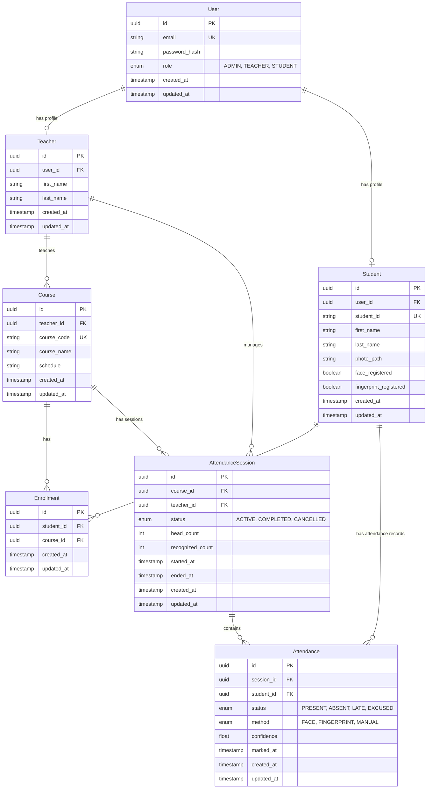

# Database Entity-Relationship Diagram

This document outlines the relational database schema used by ClassOS, managed via PostgreSQL and SQLAlchemy.

## ER Diagram

## Description of Entities

1. **User**: The base authentication model. Every Teacher, Student, and Admin has a User account used for JWT login.
2. **Teacher**: Profile data for a teacher. Tied to a User account. Teachers manage Courses and Attendance Sessions.
3. **Student**: Profile data for a student. Tied to a User account. Contains boolean flags indicating if their facial embeddings or fingerprints have been successfully enrolled.
4. **Course**: Represents an academic class (e.g. `CS101`). 
5. **Enrollment**: A many-to-many join table mapping Students to Courses. Attendance sessions will only track students explicitly enrolled in the course.
6. **AttendanceSession**: A single real-world class meeting (e.g., today's lecture). Tracks the total head count calculated by YOLOv8 vs the total recognized count calculated by dlib.
7. **Attendance (Record)**: A single student's attendance entry for a specific session. Tracks whether they were marked Present/Absent, and the exact method (Face vs Fingerprint) with the AI confidence score.
